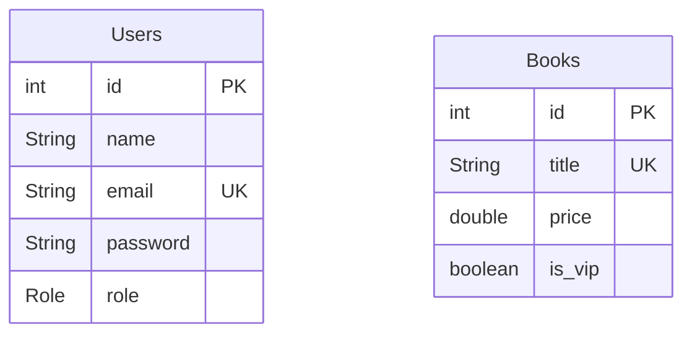

# Project Overview
___
This simple project used for explaining Spring Security.
You can watch my YouTube channel playlist where I explained the main parts like the architecture, and the implementation using JWT Authentication, also implementing a simple role based authorization.
This project is for beginner level, those who are new to Spring Security.
____
###### YouTube Channel(Playlist): https://www.youtube.com/playlist?list=PLlqzZ3mN4SChJjog1XEipwRP-MLvrwfxJ
___
This project doesn't have the spring security implementation, you have to watch my videos and implemented yourself!
____
#### Notes
- Over the years spring security got frequent updates, so you might not find the best implementation on current versions.
- In this project we are using version 6.5.1, the current version, date: 10/07/2025.
- First we will focus on the architecture, since the architecture won't change.
#### References
- I benefited a lot from those resources, from learning the architecture to implementing the JWT.
###### CodeSnippet YouTube playlist about Spring Security architecture and JWT
1. https://youtube.com/playlist?list=PL-bgVzzRdaPgUNCr1cQE_ZLKf5oJaZP4R&si=MNORfxzyfdevHJhb
###### Code with Mosh - Spring Boot part 2 course
- Spring Boot: Mastering REST API Development - [Code With Mosh](codewithmosh.com) - Paid Course - JWT implementation.
###### ByteMonk YouTube overview & flow of Spring Security and JWT
1. https://youtu.be/nhsdPVXhbHo?si=daDReBiEZaSYm4rw - Explaining Spring Security.
2. https://youtu.be/iB__rLXGsas?si=Q_YmBj98-a_1MtJk - Explaining JWT
###### ByteByteGo YouTube
- https://youtu.be/fyTxwIa-1U0?si=OO4lechSxwTfpZ6H - Explaining Session & JWT
- https://youtu.be/P2CPd9ynFLg?si=PjpJSTJbi4r_8bjC
###### Other related videos
1. https://youtu.be/_GSHvvken2k?si=Egko7gqbJ9pS61nL - YouTube - Sergey Tech - Overview.
2. https://youtu.be/h-9vhFeM3MY?si=JP3Dv4j8PwhuJWmV YouTube - Amigoscode
###### Spring Security Documentation
- https://docs.spring.io/spring-security/reference/servlet/architecture.html
---
#### Database Design
- A simple design, which is not practical, but our focus is on Spring Security.
- You just have to get the concept ;).

____
#### Docker Compose file
- For creating the database using Docker, rather downloading MYSQL applications.
- It is included in the project...
```yaml
version: '3.8'

services:
  db:
    image: postgres:latest
    ports:
      - "5432:5432"
    restart: always
    environment:
      POSTGRES_PASSWORD: rootP
      POSTGRES_USER: postgres
      POSTGRES_DB: security
    volumes:
      - pgdata:/var/lib/postgresql/data

volumes:
  pgdata:
```
#### Dependencies
- Dependencies number 1, and 2 are added in the project.
##### 1- Initial Dependencies
```xml
<dependency>
	<groupId>org.springframework.boot</groupId>
	<artifactId>spring-boot-starter-web</artifactId>
</dependency>
<dependency>
	<groupId>org.springdoc</groupId>
	<artifactId>springdoc-openapi-starter-webmvc-ui</artifactId>
	<version>2.8.9</version>
</dependency>
<dependency>
	<groupId>org.postgresql</groupId>
	<artifactId>postgresql</artifactId>
	<scope>runtime</scope>
</dependency>
<dependency>
	<groupId>org.projectlombok</groupId>
	<artifactId>lombok</artifactId>
	<optional>true</optional>
</dependency>
```
##### 2- Spring Data JPA
```xml
<dependency>
	<groupId>org.springframework.boot</groupId>
	<artifactId>spring-boot-starter-data-jpa</artifactId>
</dependency>
```
##### 3- Spring Security
```xml
<dependency>
	<groupId>org.springframework.boot</groupId>
	<artifactId>spring-boot-starter-security</artifactId>
</dependency>
<dependency>
	<groupId>org.springframework.security</groupId>
	<artifactId>spring-security-test</artifactId>
	<scope>test</scope>
</dependency>
```
##### 4- Json Web Token (JWT)
```xml
<dependency>
	<groupId>io.jsonwebtoken</groupId>
	<artifactId>jjwt-impl</artifactId>
	<version>0.12.6</version>
	<scope>runtime</scope>
</dependency>
<dependency>
	<groupId>io.jsonwebtoken</groupId>
	<artifactId>jjwt-jackson</artifactId>
	<version>0.12.5</version>
	<scope>runtime</scope>
</dependency>
<dependency>
	<groupId>io.jsonwebtoken</groupId>
	<artifactId>jjwt-api</artifactId>
	<version>0.12.6</version>
</dependency>
```
___
##### 5- .env for storing secret info
```xml
<dependency>
	<groupId>me.paulschwarz</groupId>
	<artifactId>spring-dotenv</artifactId>
	<version>4.0.0</version>
</dependency>
```
____


